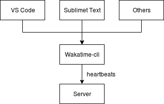

# Development Document

## Background

We need a open source WakaTime server to serve the requests from all WakaTime plugins, e.g. VSCode.

### Goal

Support [all APIs of WakaTime](https://wakatime.com/developers). We could implement the MVP in the first version, which means all [high-priority APIs](./process.md) should be supported.

### Current Design of WakaTime

Plugins rely on a wakatime-cli, which is a commandline tool used to communicate with wakatime server. The default server address is `https://api.wakatime.com/api/v1/users/current/heartbeats.bulk` (The address could be defined using the flag `--apiurl`).

Then the CLI will send all heartbeats to the server, all other endpoints are not accessed by the CLI. The server will create all resources according to the heartbeats. And all resources are used to provide the dashboard.



### Design Overview of Server

The server only provides one POST method, which is for heartbeat resource. At the beginning, we could just support projects, users and durations. Then we should support stats.

To support durations, we should import a TimeSeries DB to store the data. Projects and users are the basis of all resources, thus we need to implement them first.

```json
{
  "branches": ["init", "master"],
  "data": [
    {
      "created_at": "2018-12-23T08:00:17Z",
      "cursorpos": null,
      "duration": 641,
      "id": "c429539a-23b8-474b-8c6d-c5d7d4b6f91d",
      "lineno": null,
      "machine_name_id": "82c7d05e-df05-400c-af75-9741d38e367a",
      "project": "gommon",
      "time": 1545552000,
      "user_id": "xxxxxx"
    },
    {
      "created_at": "2018-12-23T08:10:47Z",
      "cursorpos": null,
      "duration": 36,
      "id": "a498e488-d7f5-442d-be48-c08e16e928f8",
      "lineno": null,
      "machine_name_id": "82c7d05e-df05-400c-af75-9741d38e367a",
      "project": "memcached-operator",
      "time": 1545552641.13,
      "user_id": "xxxxxx"
    },
    ...
  ],
  "end": "2018-12-24T07:59:59Z",
  "start": "2018-12-23T08:00:00Z",
  "timezone": "America/Los_Angeles"
}
```
